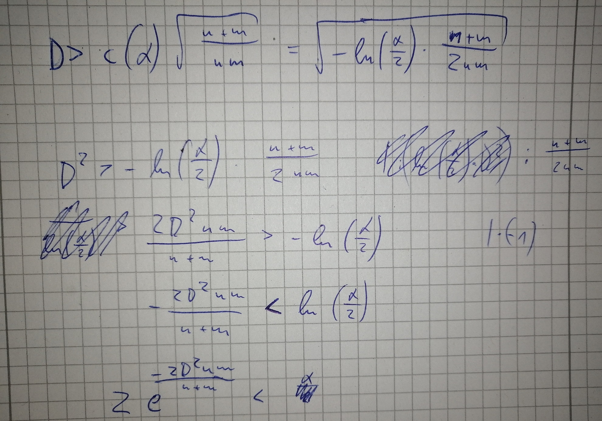

# Fragen

1. Formeln von Wikipedia umgeformt und nach alpha aufgelöst --> sollte p berechnen? Werte sind _ähnlich_ zu den Werten, die
die ks-test Implementierung ausgibt. Abweichungen sind trz deutlich. --> Weil es eine näherung ist?

--> als tiebreaker: positiver Exponent muss größer sein
2. Fragen zum Aufbau von BA
   1. theoretischer Hintergrund
   2. Umfang
   3. etc
3. Probleme mit HiCS --> spearman korrelation zwischen 2 dimensionen genommen
4. tiefe von Tree bei SoccerDataSet anpassen?
5. threshold?

1. gut so
2. mal gucken
4. test qsm (--> mal gucken, ob alle 4096 (oder so) subspaces auftauchen, wenn --maxOutputSpaces
bei HiCS hochgedreht wird)
   1. option mit länge der subspace liste
   2. option mit spearman R
3. Tiefe größer machen
5. erstmal so lassen, sollte bei längerer liste ja trz vernünftig sein

Formeln sind bisher nur von Wikipedia, sollte ich mal in einer Veröffentlichung suchen