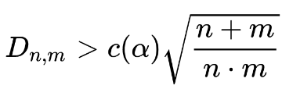
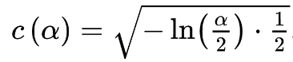

# Fragen
1. benutzen wir nur KS-test auf der "shift"-dimension? sollten wir nicht die
unterschiede der Verteilungen in allen Dimensionen des HiCS mit einem Test checken?

2. ist HiCS geeignet, um korrelationen zwischen 2 dimensionen zu untersuchen?
gäbe es nicht andere tests?

3. sicher, dass wir, nachdem in einem HiCS gesplittet wurde, wieder alle
Dimensionen nehmen, um neuen HiCS zu suchen? sollte das nicht schon vorher
gefunden worden sein, wenn es abhängigkeiten in anderen Dimensionen gibt?

4. warum ist der pvalue beim ks-test manchmal flat 0, obwohl der D-Wert nicht
besonders ist? (D-Werte die größer und kleiner sind haben beide pvalues != 0)

5. kann ich als tiebreaker für p = 0 die Formeln
[hier](https://en.wikipedia.org/wiki/Kolmogorov%E2%80%93Smirnov_test) nutzen?\
 